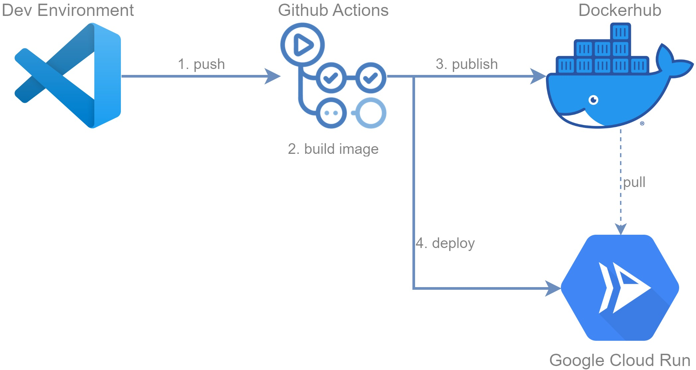

# Challenge 3

## Introducción

El objetivo del desafío es generar una imagen de contenedor de NGINX, con el agregado de que se debe modificar el archivo `index.html` que muestra en su configuración por defecto. 

Luego, se pide que se implemente un esquema de CI/CD de forma tal que al enviar al repositorio un cambio en el archivo `index.html` se genere una nueva versión de la imagen y se despliegue la misma. 

## Modificación de la imagen original

Construiremos una nueva imagen basada en NGINX, a la cual le sobreescribiremos el archivo `/usr/share/nginx/html/index.html` con una nueva versión, como se puede observar en el Dockerfile del proyecto. 

## Esquema de CI/CD

Se trabajó con **Github Actions** como herramienta de integración continua, **Dockerhub** como repositorio de imágenes de contenedores, y **Google Cloud Run (GCP)** como entorno de despliegue. Este proceso se ejecuta cada vez que se realiza una modificación en el repositorio (puntualmente en la carpeta del tercer desafío) y consta de los siguientes pasos

1. El usuario envía un cambio al repositorio.
1. Se realiza construcción de la nueva imagen de Docker.
1. Se publica la imagen generada en el paso anterior en Dockerhub.
1. Se genera una nueva revisión del servicio creado en Google Cloud Run, basada en la imagen públicada en el paso anterior.

### Consideraciones

* Se decidió trabajar con Github Actions ya que se está utilizando el mismo Github como servidor para el repositorio de código, por lo cual la integración es transparente. 
    * Además, Github Actions cuenta con todas las utilidades necesarias para facilitar la implementación del esquema de CI/CD definido.
* Se utiliza Dockerhub como repositorio de imágenes ya que se pueden crear imagenes públicas sin costo. 
* Se utiliza Google Cloud Run como entorno de ejecución ya que permite la ejecución y publicación de servicios basados en contenedores de forma directa. Como la aplicación a desplegar solamente cuenta con un contenedor, no se requiere de un entorno de orquestación de contenedores. 
    * Además, es posible acceder a una versión de prueba gratuita de la misma. 
